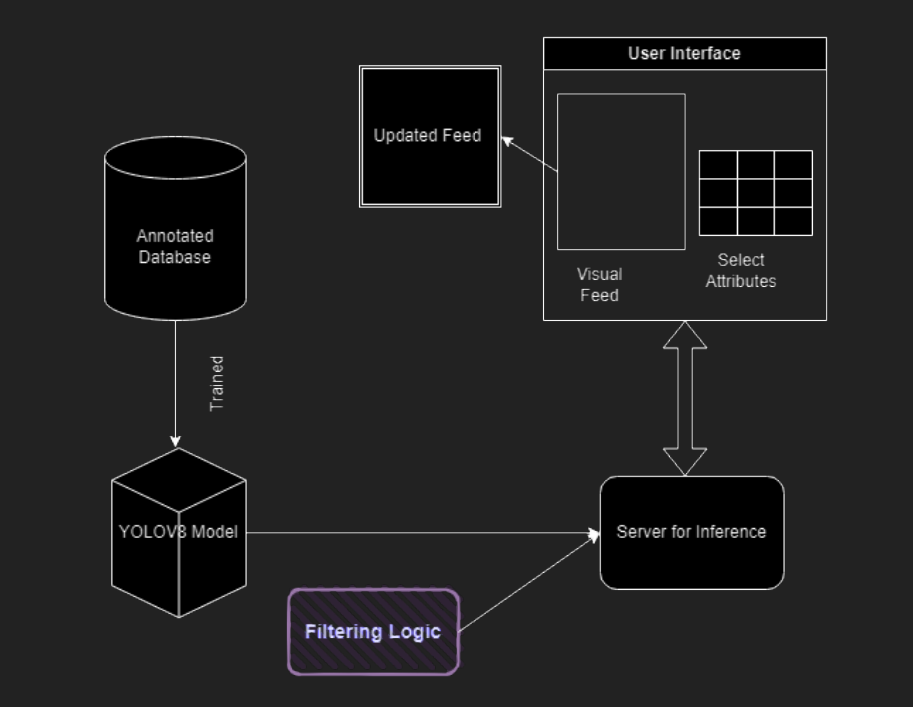
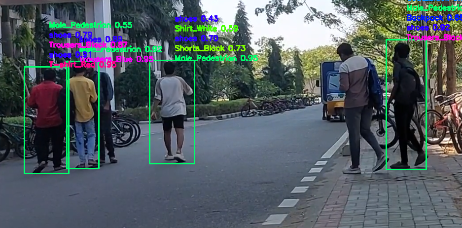

# Attribute-Based-Pedestrian-Detection

## Real-Time Pedestrian Attribute Detection with React and Flask

This project demonstrates a user-friendly application that leverages real-time camera feeds to identify individuals based on specific attributes. It highlights pedestrians with desired characteristics through bounding boxes, enhancing surveillance efficiency.

**Technology Stack:**

* Frontend: React
* Backend: Flask
* Deep Learning Models: YOLO variants

**Project Structure:**

* `notebooks`: Jupyter Notebooks containing training runs for various YOLO models.
* `app`: React and Flask application code for user interaction and model integration.

**Data Acquisition and Annotation:**

The image data used for training the model originated from public datasets:

* [Oxford Town Centre](https://www.kaggle.com/datasets/karthika95/pedestrian-detection)
* [Penn-Fudan Pedestrian Database](https://www.kaggle.com/datasets/psvishnu/pennfudan-database-for-pedestrian-detection-zip)
* [My Annotated Dataset](https://app.roboflow.com/fyp-qcetd/pedestrain-attribute-detection/)

**Supported Pedestrian Attributes:**

The application can detect a wide range of attributes, categorized as follows:

| Category    | Attributes                 |
|--------------|----------------------------|
| Gender      | Male, Female                |
| Upper Body   | T-shirt, Shirt, Coat        |
| Upper Body Color | Black, White, Red, Green, Blue, Yellow, Brown |
| Umbrella    | Yes, No                     |
| Handbag     | Yes, No                     |
| Backpack     | Yes, No                     |
| Lower Body   | Trousers, Skirt, Shorts      |
| Lower Body Color | Black, White, Red, Green, Blue, Yellow, Brown |
| Footwear     | Shoes, Boots                |
| Glasses     | Yes, No                     |
| Cap/Helmet  | Yes, No                     |

**Project Workflow:**

**Getting Started:**

To run the application locally, you'll need to set up the required dependencies and environment. Please refer to the project's directory specific README files for detailed instructions.

**Example Output:**

**Future Enhancements:**

* **Improved Model Training:** Train a larger YOLO variant on a significantly bigger dataset encompassing a wider range of attributes for enhanced real-world performance. 
* **Granular Filtering:** Implement more granular control over attribute filtering, allowing users to refine search criteria for precise results (e.g., clothing color, accessories, garment types).
* **User Prompt Integration:** Explore user prompts for pedestrian identification. The application could extract attributes (e.g., "red hat, backpack") and perform attribute-based detection for a natural interaction method.

